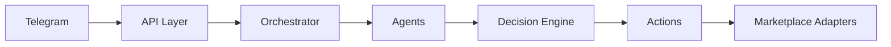

# Архитектура Zentorybot

Zentorybot строится как backend-платформа с Telegram-интерфейсом, а не как монолитный бот. Telegram отправляет команды и получает отчеты, но бизнес-логика живет в API, агентах, Decision Engine и Action Layer.

## Telegram как интерфейс управления

Telegram нужен для быстрых команд: получить daily digest, согласовать действие, посмотреть алерт, отправить событие о проблеме. В текущем scaffold настоящий Telegram API не вызывается: webhook принимает JSON и помечает обработку как mock.

## API Layer

FastAPI принимает HTTP-запросы: `/health`, `/ready`, `/telegram/webhook`, `/actions/preview`, `/actions/approve`, `/reports/daily`. API нормализует входные события и передает их в Orchestrator.

## Agents

Каждый агент отвечает за отдельный процесс менеджера маркетплейсов. Агент анализирует событие и предлагает действия. Сейчас действия mock, но контракты готовы к подключению реальных данных.

## Decision Engine

Decision Engine оценивает риск события и действий. Правило approval:

- `LOW` -> `NONE`.
- `MEDIUM` -> `SOFT_APPROVAL`.
- `HIGH` -> `HARD_APPROVAL`.
- `CRITICAL` -> `HARD_APPROVAL`.

## Action Layer

Action Layer хранит proposed actions, умеет находить, approve/reject и mock-execute действие. Это будущая точка подключения реального исполнения через маркетплейс-адаптеры.

## Integrations

Интеграции разделены по площадкам: Wildberries, Ozon, Яндекс Маркет и Telegram. Методы `fetch_orders`, `fetch_stocks`, `fetch_prices`, `fetch_reviews`, `fetch_questions`, `fetch_ads_stats`, `update_price`, `send_reply`, `send_telegram_message` возвращают mock-данные.

## Database

PostgreSQL планируется как основное хранилище tenants, marketplace accounts, events, commands, approvals и audit logs. SQLAlchemy-модели уже выделены, Alembic подготовлен.

## Audit log

Audit log должен фиксировать: кто инициировал действие, какое событие обработано, какие агенты сработали, какой риск поставлен, кто подтвердил действие и что было отправлено в адаптер.

## Approval workflow

Approval workflow защищает бизнес от ошибочной автоматизации. Низкорисковые действия можно выполнять автоматически, среднерисковые требуют мягкого подтверждения, высокорисковые — жесткого ручного approval.

## Idempotency

Idempotency защищает от повторного выполнения одного действия при дублях webhook, retries или ручном повторе команды. Для каждого payload генерируется стабильный ключ.

## Режимы автоматизации

### Shadow mode

Система только наблюдает, строит рекомендации и ничего не исполняет.

### Assisted mode

Система готовит черновики и задачи, человек вручную переносит результат в кабинет.

### Semi-auto mode

Система исполняет только подтвержденные действия.

### Controlled auto mode

Система автоматически исполняет заранее разрешенные низкорисковые действия в лимитах.
